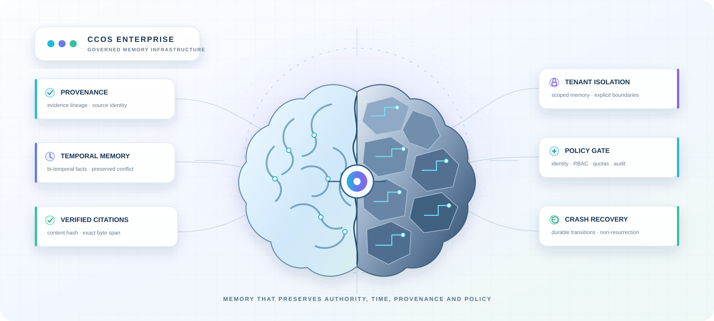
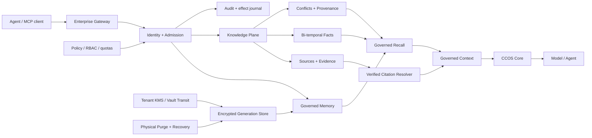

<div align="center">

<!-- Intentionally not wrapped in a link: the hero is decorative and must remain non-clickable. -->
<picture>
  
</picture>

# CCOS Enterprise

**Governed, multi-tenant memory infrastructure for AI systems.**

Persistent knowledge, evidence, policy and recovery around the
[CCOS Core](https://github.com/Memorithm/CCOS-Core) cognitive kernel.

[](https://github.com/Memorithm/CCOS-Enterprise/actions/workflows/ci-full.yml)
[](https://github.com/Memorithm/CCOS-Enterprise/actions/workflows/ci-security.yml)
[](https://github.com/Memorithm/CCOS-Enterprise/actions/workflows/provider-recovery.yml)
[](./rust-toolchain.toml)
[](./LICENSE.md)

</div>

CCOS Enterprise treats long-lived AI memory as **governed infrastructure**, not as an unqualified vector store. The system binds memory operations to identity, tenant, policy, provenance and durable state transitions. Its Knowledge Plane preserves temporal facts and contradictions; its served memory path can return evidence-backed context with exact source-byte citations; its provider layer supports governed physical purge, crash recovery and optional tenant envelope encryption.

The project is written primarily in Rust and keeps **authority separate from similarity**: a semantically close item is not automatically trusted, a verified content hash is not automatically true, and a memory observation is not silently promoted into canonical knowledge.

> **Research position.** CCOS Enterprise is being evaluated against strong RAG baselines under a reproducible protocol. The repository does **not** currently claim that CCOS is superior to modern RAG end to end. See [RAG Comparative Campaign](docs/RAG_COMPARATIVE_CAMPAIGN.md).

---

## Why CCOS Enterprise

| | Capability | What it means in this repository |
|---|---|---|
| **01** | **Governed admission** | Signed identity, organization/tenant scope, RBAC, quotas, policy gates, replay suppression and audit settlement precede governed operations. |
| **02** | **Temporal knowledge** | Canonical journal replay, bi-temporal facts, explicit invalidation and preserved contradictions instead of silent overwrite. |
| **03** | **Evidence lineage** | Sources, evidence, facts and derived memory remain traceable through tenant-scoped identifiers and content hashes. |
| **04** | **Verified citations** | Served context can bind citations to exact source bytes after content-hash and byte-span verification. Integrity is distinguished from truth. |
| **05** | **Governed forgetting** | Physical purge rebuilds the managed provider without purged payloads/vectors and retains a durable non-resurrection floor inside the governed root. |
| **06** | **Operational recovery** | Generation stores, backup/restore, crash recovery, envelope-key rotation and fail-closed validation are explicit engineering concerns. |

---

## System at a glance



The canonical Knowledge journal remains authoritative; graph/vector structures are treated as reconstructible projections. The Enterprise boundary is enforced on the dependency graph rather than by pretending that repository separation is a security boundary.

---

## What is implemented and qualified today

### Governed memory at scale

The committed A09 campaign measured the served governed-memory path at **1k, 10k and 100k assets per tenant**, including single-tenant and four-tenant concurrent profiles.

| Assets / tenant | Tenants | p50 | p95 | p99 | Median throughput | Max query RSS | Median recovery |
|---:|---:|---:|---:|---:|---:|---:|---:|
| 1,000 | 1 | 0.049 ms | 0.059 ms | 0.107 ms | 16,580.787 req/s | 9.043 MiB | 0.027 s |
| 10,000 | 1 | 0.117 ms | 0.130 ms | 0.188 ms | 7,784.949 req/s | 72.070 MiB | 0.287 s |
| 100,000 | 1 | 0.548 ms | 0.666 ms | 1.043 ms | 1,670.784 req/s | 679.250 MiB | 2.839 s |
| 100,000 | 4 | 0.572 ms | 0.778 ms | 4.754 ms | 5,344.748 req/s | 1,558.176 MiB | 10.957 s |

These are **bounded synthetic measurements**, not an SLO. The published profile used 32-dimensional vectors and 64-byte payloads and excluded MCP transport, encoder and generator costs. Hardware, methodology, raw data and limitations are recorded in [Governed memory measurement — 2026-09-19](docs/benchmarks/governed-memory-20260919.md) and the [benchmark contract](docs/GOVERNED_MEMORY_BENCHMARK.md).

### Physical purge and non-resurrection

`memory.purge` removes the selected managed asset and its derived descendant closure from provider vectors/payloads, publishes durable transition metadata, and resumes or refuses safely after recorded crash boundaries. Purged identities are reserved by a retained floor to prevent local resurrection from older generations.

The guarantee is intentionally scoped: it does not claim forensic secure erase of storage media, deletion of independent external copies, or protection against replacing the **entire** governed root with an older backup. See [Governed physical purge and compaction](docs/GOVERNED_PHYSICAL_PURGE.md).

### Verified memory citations

The citation resolver joins admitted memory lineage to exact `EvidenceRecord` and `SourceRecord` identities, verifies canonical SHA-256 source hashes and byte ranges, and returns exact quoted source bytes. It does not fetch arbitrary source URLs and it does not infer truth from a hash.

See [Verified memory citations](docs/VERIFIED_MEMORY_CITATIONS.md).

### Tenant envelope encryption

The governed provider can operate with envelope encryption using per-artifact random data keys and explicit tenant/key bindings. The current connector includes a Vault Transit integration and a governed key-rotation/recovery protocol.

This does not claim FIPS certification, production Vault deployment, or encryption of every external source and backup in an operator's environment. See [Tenant envelope encryption, rotation and recovery](docs/TENANT_ENVELOPE_KMS.md).

---

## Beyond retrieval: the Knowledge Plane

CCOS Enterprise maintains a canonical, tenant-scoped knowledge state designed for information that changes over time.

Core invariants include:

- **deterministic journal replay** and canonical state hashing;
- **bi-temporal facts**: world validity and transaction history remain separate;
- **contradictions preserved explicitly** instead of destructive last-write-wins replacement;
- **mandatory evidence references** for assertions;
- **typed authority** separating authoritative data, observations, deterministic inferences and LLM outputs;
- **fail-closed corruption handling** and bounded recovery semantics;
- **reconstructible projections**: future graph/vector accelerators do not become the source of truth.

Architecture: [Knowledge Plane](docs/KNOWLEDGE_PLANE_ARCHITECTURE.md) ·
Decision intelligence: [P5](docs/KNOWLEDGE_PLANE_P5_DECISION_INTELLIGENCE.md) ·
Promotion model: [Knowledge promotion](docs/KNOWLEDGE_PROMOTION.md)

---

## CCOS vs. RAG: measured, not declared

The research objective is to test whether governed memory improves supported task completion on problems where **time, contradiction, provenance, deletion and authorization** matter.

The comparison protocol requires the same:

- source evidence and authorization state;
- token/context budgets;
- generator and tokenizer;
- retrieval cutoff and operating constraints;
- encoder configuration when an encoder is shared;
- blinded adjudication and result binding;
- latency, memory, restart, token and cost measurements.

Baselines include lexical, dense, hybrid and reranked RAG. A proprietary encoder is not accepted as a product dependency merely because it is proprietary; it must first beat qualified alternatives under the frozen experiment.

The evaluator deliberately emits `superiority_claim: false` until a real, independently judged campaign satisfies the preregistered decision rule.

Read:
[Reproducible RAG comparison campaign](docs/RAG_COMPARATIVE_CAMPAIGN.md) ·
[Governed memory vs RAG](docs/GOVERNED_MEMORY_VS_RAG.md)

---

## Product boundary

CCOS Enterprise, CCOS Core and CCOS Research Lab are separate products.

- `core/` contains the co-located CCOS Core subtree so Core and Enterprise changes can be tested in one workspace without duplicating the kernel.
- Enterprise does **not** absorb RSI, Forge or Research Lab self-modification capabilities.
- OctaSoma is reachable through the dedicated `ccos-enterprise-octasoma` adapter; Core does not acquire that dependency.
- The Enterprise gateway is an allowlist. Research/raw namespaces and explicitly forbidden execution/modification capabilities are rejected at the product boundary.
- Advanced Q-Page variants are tenant-policy activated and do not mutate Core's standard primitives.

Core synchronization remains deliberate:

```bash
git subtree pull --prefix=core <core-remote> main
git subtree push --prefix=core <core-remote> <branch>
```

Memory boundary details: [OctaSoma integration](docs/OCTASOMA_INTEGRATION.md) ·
Gateway boundary: [Hermes integration](docs/HERMES_INTEGRATION.md)

---

## Repository map

```text
CCOS-Enterprise/
├── core/                         # co-located CCOS Core subtree
├── crates/                       # Enterprise auth, policy, memory, knowledge, MCP, backup…
├── adapters/                     # external product adapters, including DeepSeek Harness
├── docs/                         # architecture, security, experiments and operating contracts
├── fixtures/                     # frozen test/evaluation fixtures
├── scripts/                      # policy, evaluation and qualification tooling
└── tests/                        # composed conformance paths
```

Selected crates:

| Crate | Responsibility |
|---|---|
| `ccos-enterprise-auth` | actor/org identity and authentication strength |
| `ccos-enterprise-rbac` | organization-scoped roles and permissions |
| `ccos-enterprise-tenancy` | typed tenant boundaries |
| `ccos-enterprise-policy` | quotas, budgets and allowlists |
| `ccos-enterprise-gateway` | governed MCP namespace boundary |
| `ccos-enterprise-knowledge*` | canonical knowledge model, state and journal |
| `ccos-enterprise-memory` | governed recall, context and bundle contracts |
| `ccos-enterprise-octasoma` | tenant-isolated provider integration |
| `ccos-enterprise-envelope` | tenant envelope encryption |
| `ccos-enterprise-backup` | backup manifests and restore gates |
| `ccos-enterprise-observability` | bounded metrics and audit correlation |
| `ccos-enterprise-mcp` | governed MCP front door and stdio server |
| `tests/ccos-enterprise-conformance` | composed product and adversarial tests |

---

## Build and verify

The repository pins Rust **1.89.0** for the product baseline.

```bash
git clone https://github.com/Memorithm/CCOS-Enterprise.git
cd CCOS-Enterprise

cargo fmt --all -- --check
cargo check --workspace --locked
cargo test --workspace --locked
```

Build the governed MCP server:

```bash
cargo build -p ccos-enterprise-mcp \
  --bin ccos-enterprise-mcp-server \
  --locked
```

Security-, tenant-, KMS- and evidence-sensitive deployments require explicit operator configuration; the repository does not invent default production keys or silently downgrade encrypted stores to plaintext.

Useful focused qualification:

```bash
# Governed physical purge / recovery
cargo test -p ccos-enterprise-octasoma \
  --lib generation::purge::tests --locked

# Served evidence path
cargo test -p ccos-enterprise-mcp \
  --test governed_evidence_stdio --locked

# Reproducible RAG campaign contract
python3 scripts/test-rag-campaign.py
```

CI definitions live in [`.github/workflows`](.github/workflows).

---

## Documentation

| Area | Primary document |
|---|---|
| Enterprise security model | [ENTERPRISE_SECURITY_MODEL.md](docs/ENTERPRISE_SECURITY_MODEL.md) |
| Knowledge architecture | [KNOWLEDGE_PLANE_ARCHITECTURE.md](docs/KNOWLEDGE_PLANE_ARCHITECTURE.md) |
| Governed memory store | [GOVERNED_MEMORY_STORE_CONTRACT.md](docs/GOVERNED_MEMORY_STORE_CONTRACT.md) |
| Verified citations | [VERIFIED_MEMORY_CITATIONS.md](docs/VERIFIED_MEMORY_CITATIONS.md) |
| Physical purge | [GOVERNED_PHYSICAL_PURGE.md](docs/GOVERNED_PHYSICAL_PURGE.md) |
| Envelope KMS | [TENANT_ENVELOPE_KMS.md](docs/TENANT_ENVELOPE_KMS.md) |
| Backup / restore | [BACKUP_AND_RESTORE.md](docs/BACKUP_AND_RESTORE.md) |
| RAG comparison | [RAG_COMPARATIVE_CAMPAIGN.md](docs/RAG_COMPARATIVE_CAMPAIGN.md) |
| Licensing | [LICENSING.md](LICENSING.md) |
| Contribution rules | [CONTRIBUTING.md](CONTRIBUTING.md) |

---

## Licensing and governance

Required Notice: **Copyright 2026 Tarek Zekriti** — [Memorithm](https://github.com/Memorithm/).

Sole active human contributor identity: **CHECKUPAUTO / MEMOPERF**. These are two accepted aliases for the same human contributor; automated systems are tools, not contributors.

The repository is distributed under the [PolyForm Noncommercial License 1.0.0](LICENSE.md). Commercial use is handled separately; see [LICENSING.md](LICENSING.md). Governance and contribution requirements are documented in [GOVERNANCE.md](GOVERNANCE.md) and [CONTRIBUTING.md](CONTRIBUTING.md).

---

<div align="center">

**CCOS Enterprise** — memory that preserves authority, time, provenance and policy.

</div>
